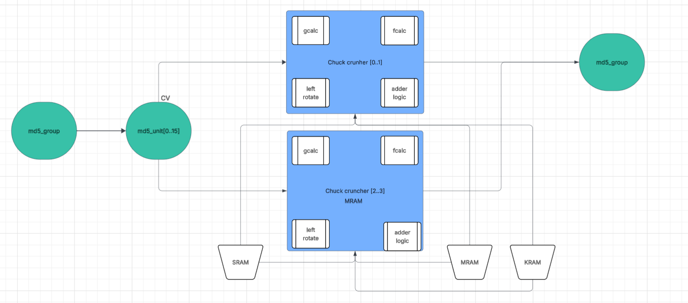

# Decryption-SoC
This project, developed for a 4th-year SoC course, demonstrates a custom hardware-accelerated MD5 decryption IP designed and deployed on the DE1-SoC development board.
Harnessing the capability of a Heterogeneous HPS/FPGA environment, the design leverages an Intel Cyclone V FPGA (hard logic) for processing and dual-core ARM Cortex-A9 HPS (soft logic) running embedded Linux for control, coordination, and result visualization.
The design is implmented using Intel Quartus 14 & Qsys for FPGA IP design and Avalon bus integration and Altera Eclipse for embedded Linux development and software-side control of the system.

The system architecture enables a practical demonstration of hardware/software co-design, where compute-intensive tasks are offloaded to the FPGA while the HPS manages control logic and user interfacing.

## Key Features 
- Custom MD5 Decryption IP implementing parallelism through two chunk_cruncher units, each performing 64-round compression computations.
- Supports dual execution modes: 
  - Sequential Mode: Controlled by incrementing the start signal core-by-core.
  - Concurrent Mode: All 32 cores activated simultaneously for high-throughput operation.
- Flexible Avalon-based architecture enables seamless integration and configurability from the HPS.

The block diagram below summarizes the structure of decrypting IP.

